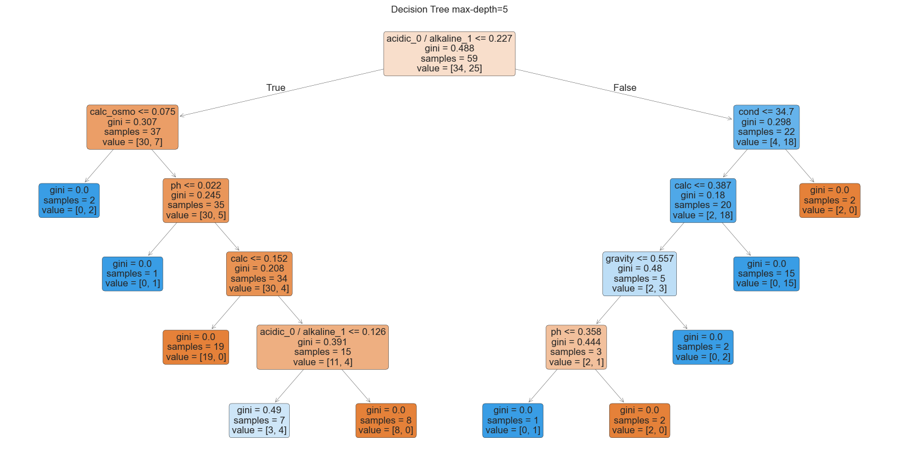

# 🧪 Kidney Stone Prediction using Urine Analysis

This project is a machine learning pipeline that predicts the likelihood of kidney stone presence based on urine analysis. It utilizes a publicly available dataset from Kaggle and includes end-to-end steps: from preprocessing to model evaluation.  
⚠️ **Disclaimer**: This model is developed for **educational and research purposes only**. It is **not** intended for real-world medical diagnosis or treatment.

---

## 🔗 Live Demo

Try the model in action via this notebook or app:

- [Streamlit Web App](https://kidneystonepredictionbasedonurineanalysis-3feymtrhp8hg3gbmb6hq.streamlit.app/)


## 📁 Dataset

- **Source**: [Kaggle – Kidney Stone Prediction based on Urine Analysis](https://www.kaggle.com/datasets/...)
- **Type**: Structured tabular data  
- **Target**: Binary classification (`0` - No stone, `1` - Stone)

---

## 📌 Project Highlights

- Data cleaning and preprocessing
- Exploratory Data Analysis (EDA)
- Outlier detection and removal
- Feature scaling and encoding
- Training with multiple classifiers:
  - Logistic Regression
  - Support Vector Machine (SVM)
  - K-Nearest Neighbors (KNN)
  - Decision Tree
  - Random Forest
  - AdaBoost
  - Gradient Boosting
- Model evaluation using:
  - Accuracy, Precision, Recall, F1-score
  - ROC AUC and confusion matrix
- Visualization of Decision Trees and Ensemble Models

---

## 🚀 How to Run

1. **Clone the repo**
   ```bash
   git clone https://github.com/yourusername/kidney-stone-prediction.git
   cd kidney-stone-prediction
    ````

2. **Install dependencies**

   ```bash
   pip install -r requirements.txt
   ```

3. **Run the notebook**
   Open `Kidney_Stone_Prediction.ipynb` in Jupyter Notebook or VS Code and execute step-by-step.

---

## 🧪 Project Structure

```
📦 kidney-stone-prediction/
├── 📊 Kidney_Stone_Prediction.ipynb     # Main notebook
├── 📁 data/
│   └── kidney_stone_dataset.csv         # Raw dataset
├── 📈 outputs/                           # Saved visualizations/models (optional)
├── 📄 README.md                          # Project documentation
└── 📄 requirements.txt                   # Python dependencies
```

---

## 🛠️ Coding Workflow

### 1. Data Preprocessing

* Handle missing values
* Encode categorical features (e.g., 'Yes'/'No' → 1/0)
* Normalize numeric columns (if needed)

### 2. Outlier Detection

* Remove anomalies using IQR (Interquartile Range) method

### 3. Feature Selection & Scaling

* Drop irrelevant or low-variance features
* Apply `StandardScaler` or `MinMaxScaler`

### 4. Model Training

* Split dataset into train/test sets (e.g., 80/20)
* Train and evaluate models using cross-validation
* Tune hyperparameters manually or with GridSearchCV (optional)

### 5. Evaluation

* Use confusion matrix and classification reports
* Compare performance across models
* Plot decision boundaries (for 2D visualization)

### 6. Interpretation

* Visualize tree-based models
* Feature importance for ensemble methods

---

## 📊 Sample Output

* Model accuracy: 91.3% (Random Forest)
* Best Recall Score: 92% (Gradient Boosting)
* ROC AUC: 0.94
* Feature importance shows `Gravity`, `pH`, and `Calcium` as top predictors

---

## 🙋‍♂️ Author

* **Name**: Youssef
* **Background**: Machine Learning Engineer | AI & Communication Engineering Student
* **GitHub**: [github.com/yourusername](https://github.com/YosefSamy019)

---

## 🖼 Sample Visualizations




## ⚠️ Disclaimer

> This model is intended **only for educational purposes**. It should not be used for real-world medical decisions. Please consult certified healthcare professionals for any health-related assessments.
