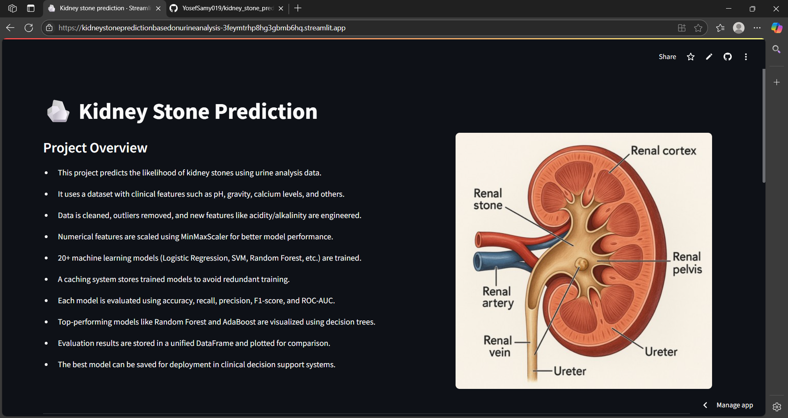
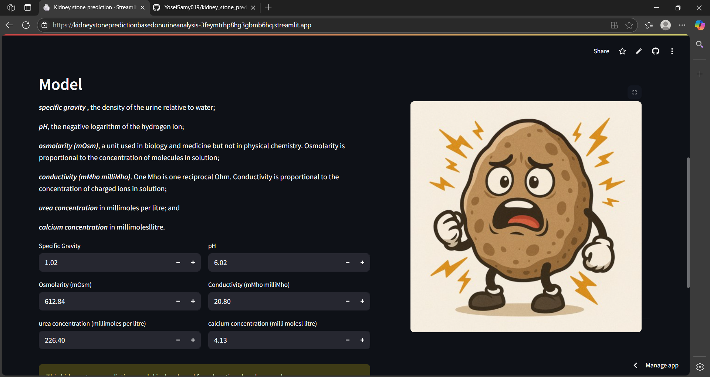
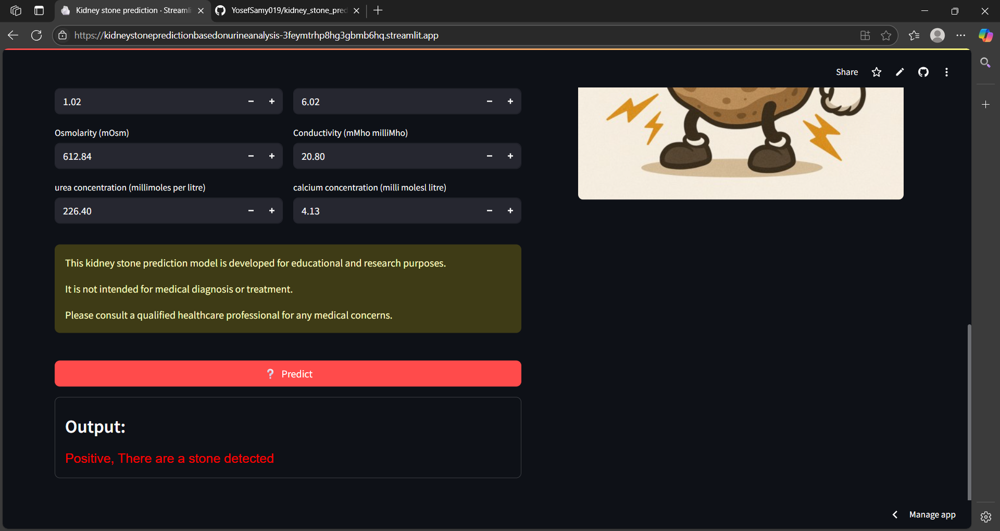

# 🧪 Kidney Stone Prediction using Urine Analysis

This project is a machine learning pipeline that predicts the likelihood of kidney stone presence based on urine analysis. It utilizes a publicly available dataset from Kaggle and includes end-to-end steps: from preprocessing to model evaluation.  
⚠️ **Disclaimer**: This model is developed for **educational and research purposes only**. It is **not** intended for real-world medical diagnosis or treatment.

---

## ⚠️ Disclaimer

> This model is intended **only for educational purposes**. It should not be used for real-world medical decisions. Please consult certified healthcare professionals for any health-related assessments.

---

## 🔗 Live Demo

Try the model in action via this notebook or app:

- [Streamlit Web App](https://kidneystonepredictionbasedonurineanalysis-3feymtrhp8hg3gbmb6hq.streamlit.app/)

## 📁 Dataset

- **Source**: [Kaggle – Kidney Stone Prediction based on Urine Analysis](https://www.kaggle.com/datasets/vuppalaadithyasairam/kidney-stone-prediction-based-on-urine-analysis/data)
- **Type**: Structured tabular data  
- **Target**: Binary classification (`0` - No stone, `1` - Stone)

---

## 📌 Project Highlights

- Data cleaning and preprocessing
- Exploratory Data Analysis (EDA)
- Outlier detection and removal
- Feature scaling and encoding
- Training with multiple classifiers:
  - Logistic Regression
  - Support Vector Machine (SVM)
  - K-Nearest Neighbors (KNN)
  - Decision Tree
  - Random Forest
  - AdaBoost
  - Gradient Boosting
- Model evaluation using:
  - Accuracy, Precision, Recall, F1-score
  - ROC AUC and confusion matrix
- Visualization of Decision Trees and Ensemble Models

---

## 🛠️ Coding Workflow

### 1. Data Preprocessing

* Handle missing values
* Encode categorical features (e.g., 'Yes'/'No' → 1/0)
* Normalize numeric columns (if needed)

### 2. Outlier Detection

* Remove anomalies using IQR (Interquartile Range) method

### 3. Feature Selection & Scaling

* Drop irrelevant or low-variance features
* Apply `MinMaxScaler`

### 4. Model Training

* Split dataset into train/test sets (e.g., 80/20)
* Train and evaluate models using cross-validation
* Tune hyperparameters manually or with GridSearchCV (optional)

### 5. Evaluation

* Use confusion matrix and classification reports
* Compare performance across models
* Plot decision boundaries (for 2D visualization)

### 6. Interpretation

* Visualize tree-based models

---

## 🖼 Sample Visualizations

